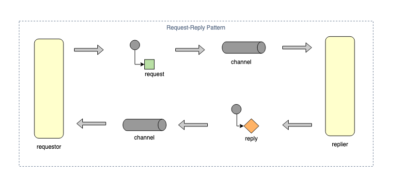
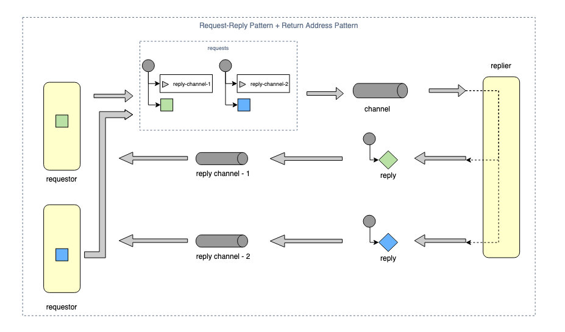
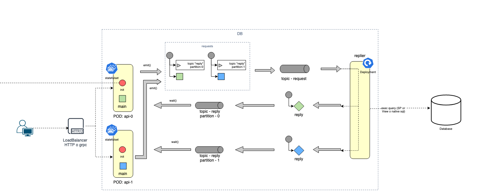
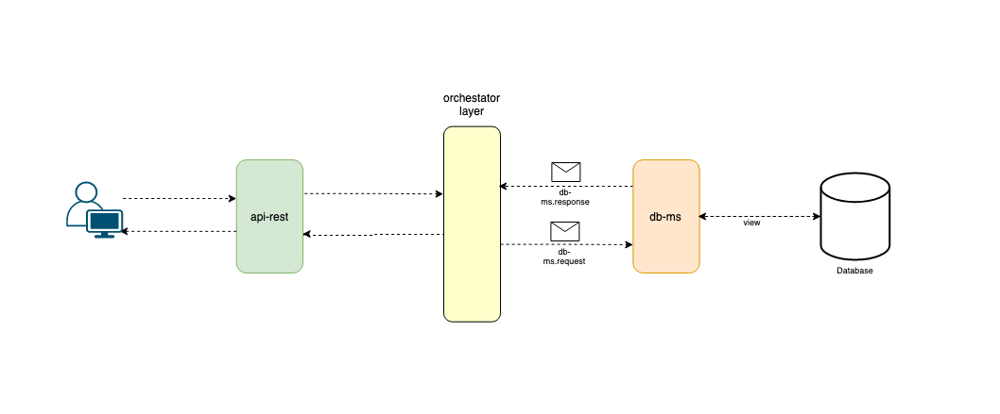
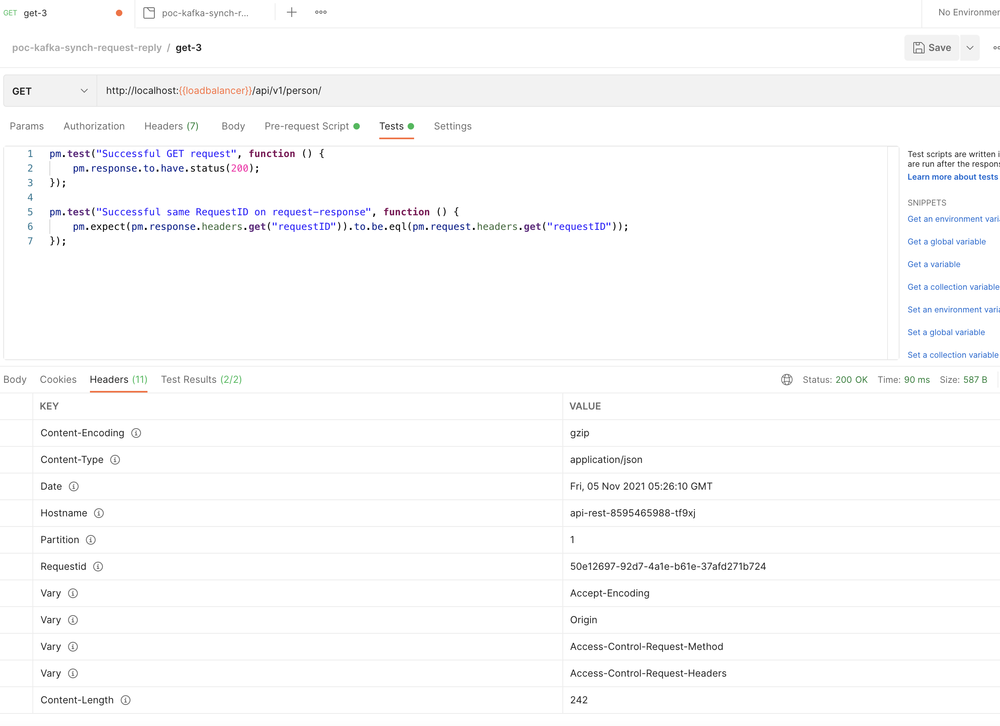
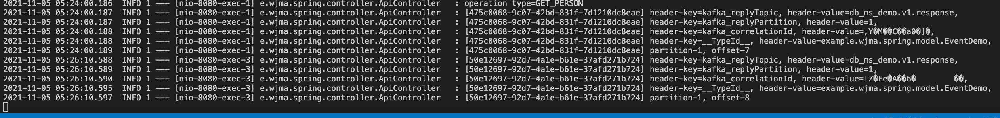
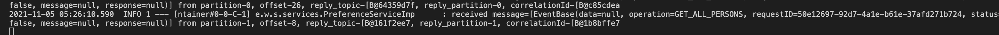

## Synchronous Request-Reply(Response) Pattern with multiple partitions, it's a demo very simple"

this repository is an example of how implement **"synchronous request-reply" pattern** and **"return address" pattern** using **spring-kafka** and 
the **"init-container" property from pod kubernetes** to achieve the below:

* Send a request to an api that in turn will send an event to a kafka topic called "a.b.request" - and a partition - so this api is listening
the response in a kafka topic called "a.b.response" and it can return the response to the client. (see the images below)
* Using the init-container, we can scale the topic from 1 to "N" partitions - scale up but not down - that way the api subscribes to partition that kafka assings to it.

> let's see the following patterns:






### Requirements and steps to reproduce the example
* install docker
* install k3s and k3d (a lightweight kubernetes)
* build the docker images
    - database
    ```shell
    docker build -t user-docker-hub/simple-bd ./sources/database/
    docker push user-docker-hub/simple-bd
    ```

    - db-ms
    ```shell
    docker build -t user-docker-hub/simple-db-ms ./sources/db-ms/
    docker push user-docker-hub/simple-db-ms
    ```

    - api-rest
    ```shell
    docker build -t user-docker-hub/simple-api-rest ./sources/api-rest/
    docker push user-docker-hub/simple-api-rest
    ```

    - init-container
    ```shell
    docker build -t user-docker-hub/simple-init-container ./sources/init-container/
    docker push user-docker-hub/simple-init-container
    ```

* create a local kubernetes cluster 
    ```shell
    k3d cluster create test --servers 1 --agents 4 --port 8080:80@loadbalancer --image rancher/k3s:v1.18.20-k3s1 --wait

    export KUBECONFIG=$(k3d kubeconfig write test)
    ```

* deploy the following:
    - kafka (orchestator layer)
        ```shell
        kubectl apply -f k8s/tools/kafka.yaml
        ```

    - kafdrop (viewer for kafka)
        ```shell
        kubectl apply -f k8s/tools/kafdrop.yaml
        kubectl port-forward svc/kafdrop 9000:9000
        ```

    - mysql (bd)
        ```shell
        kubectl apply -f k8s/tools/mysql-sts.yaml
        ```

* deploy the applications:
    - db-ms
        ```shell
        kubectl apply -f k8s/db-ms.yaml
        ```

    - api-rest
        ```shell
        kubectl apply -f k8s/api-rest.yaml

    - ingress
        ```shell
        kubectl apply -f k8s/ingress-k3s.yaml

* now, you can test with postman, curl or another tools, by example:
    
    
    